<div align="center">


# Sanctum

**Seal yourself in.** *Finish what you started.*

A focus app for Windows that actually holds. Pick what you're working on, enter focus, and Sanctum opens what the work needs, closes what distracts you, and keeps the door shut until the time is up. Getting out early takes real effort, or a friend's approval.

[](https://github.com/ryanhang07/sanctum/releases/latest)

[](https://github.com/ryanhang07/sanctum/actions/workflows/ci.yml)
[](LICENSE)


</div>

---

## Why Sanctum

Most blockers are easy to talk your way out of. Sanctum is built around three ideas:

- **A seal that holds.** Flagged apps close the moment they open, sites and keyword tabs are blocked in every browser, and the seal survives restarts. If Sanctum is killed mid-session, a Windows service brings it back.
- **Someone else holds the key.** Leaving early means a written reason, a wait, retyping a paragraph, and then a cooldown, or your accountability partner approving it from their phone with a PIN only they know.
- **Your day in one place.** Today's tasks, routines, and Google Calendar sit next to the focus button, so the next block starts the right profile with one keystroke.

It's free, open source, and local first: your activity, history, trackers, and notes never leave your PC.

---

## A tour

### Focus: Open, Sealed, and In event

Pick a profile and a length on the wheels and press **Enter focus**. Sanctum closes the apps you flagged, opens the ones the profile needs, and the whole app turns cobalt. A meeting on your calendar puts it In event, in coral, and can queue focus for when the meeting ends.

| Open | Sealed |
|---|---|
| 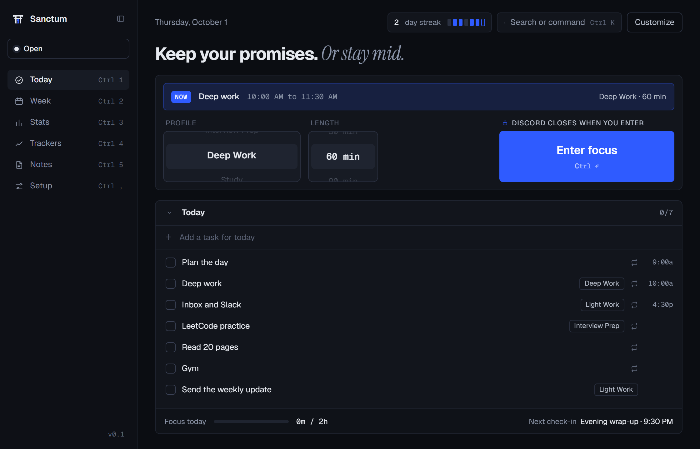 | 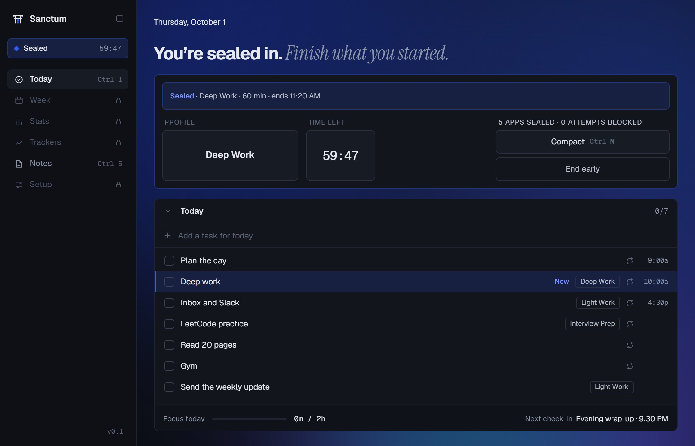 |

| In event | Sanctum held |
|---|---|
| 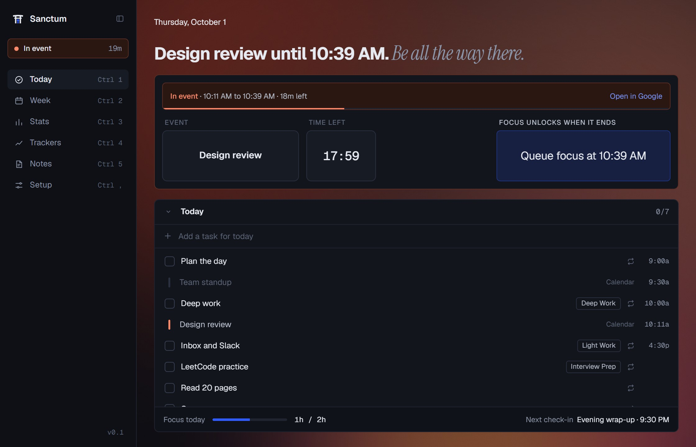 | 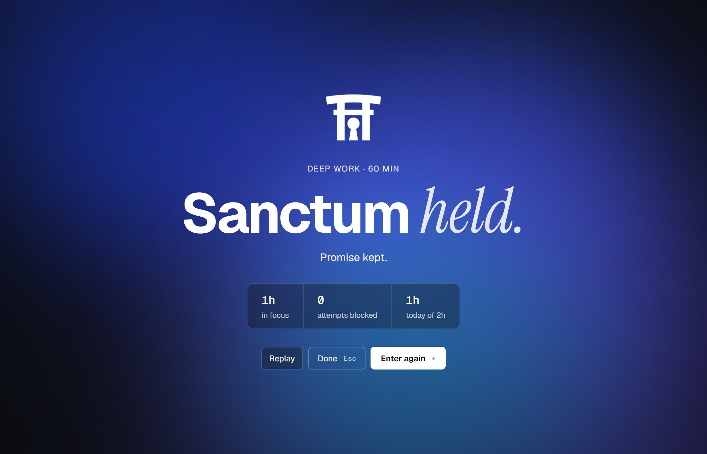 |

When a session ends, the **Sanctum held** page shows what you kept: minutes in focus, attempts blocked, and today against your goal. Link a session to a task first, and it offers to check it off.

### Caught, and sent back

Open something you flagged and it closes, with a note that sends you back to what you were doing. The browser extension does the same for sites, links, and title keywords like "shorts", in Chrome, Edge, Brave, and Comet.

| The app overlay | The browser extension |
|---|---|
| 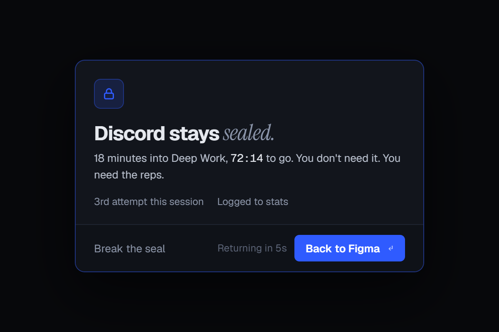 | 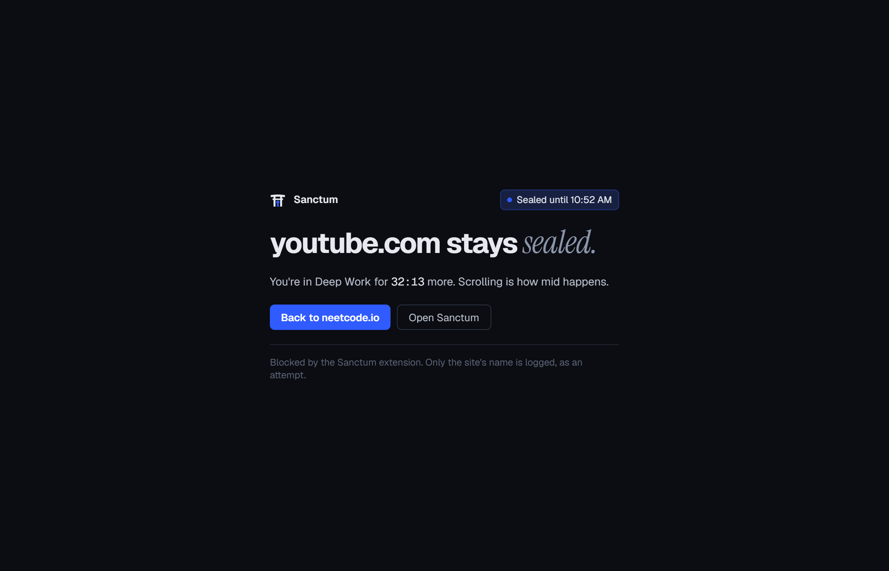 |

### Out of the way while you work

A compact timer floats over your work (Ctrl M), and the tray panel starts a session or checks off a task without opening the window.

<p align="center">
  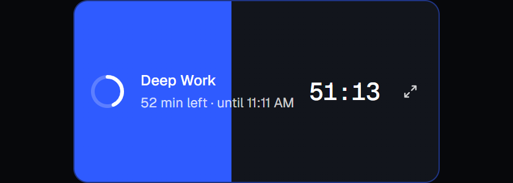
  &nbsp;&nbsp;
  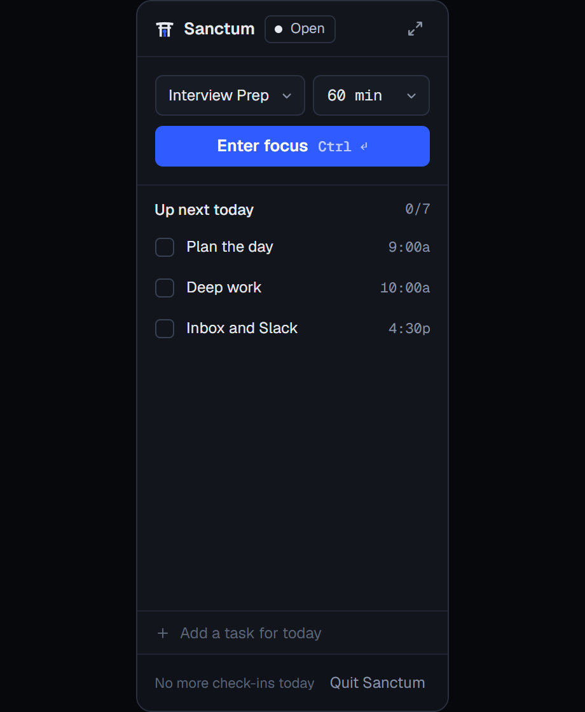
</p>

### Plan the week

Routines and one-time tasks, synced two ways with Google Calendar. Tag a block with a profile and Home suggests it when it starts. Drag items between days, or edit a whole recurring series.

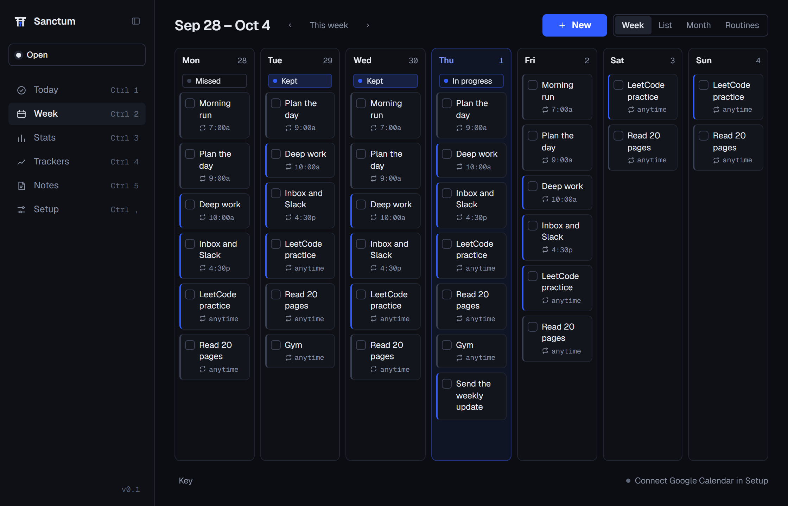

### See where the time went

Streaks, focus against your daily goal, what tempted you most, and how your time split between productive, neutral, and distracting.

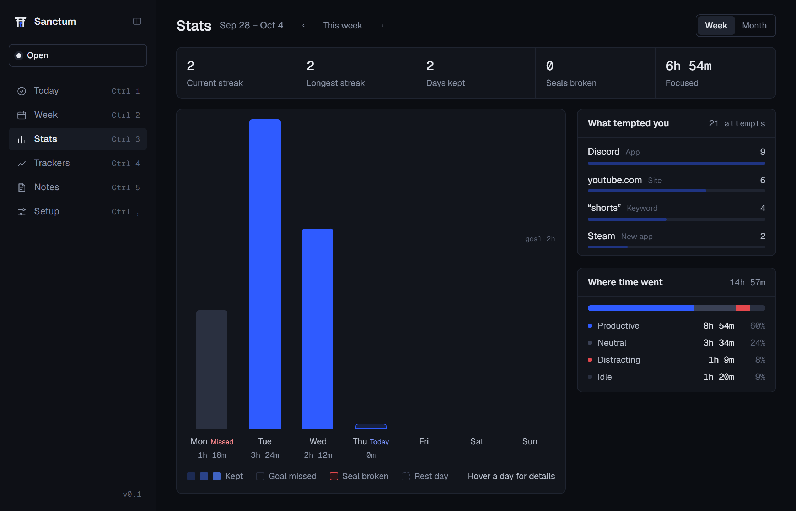

### Track anything, and keep notes

Custom trackers (numbers, yes/no, 1 to 10, or text) with charts and scheduled check-ins, plus plain notes with lists and checkboxes for everything that isn't a task.

| Trackers | Notes |
|---|---|
| 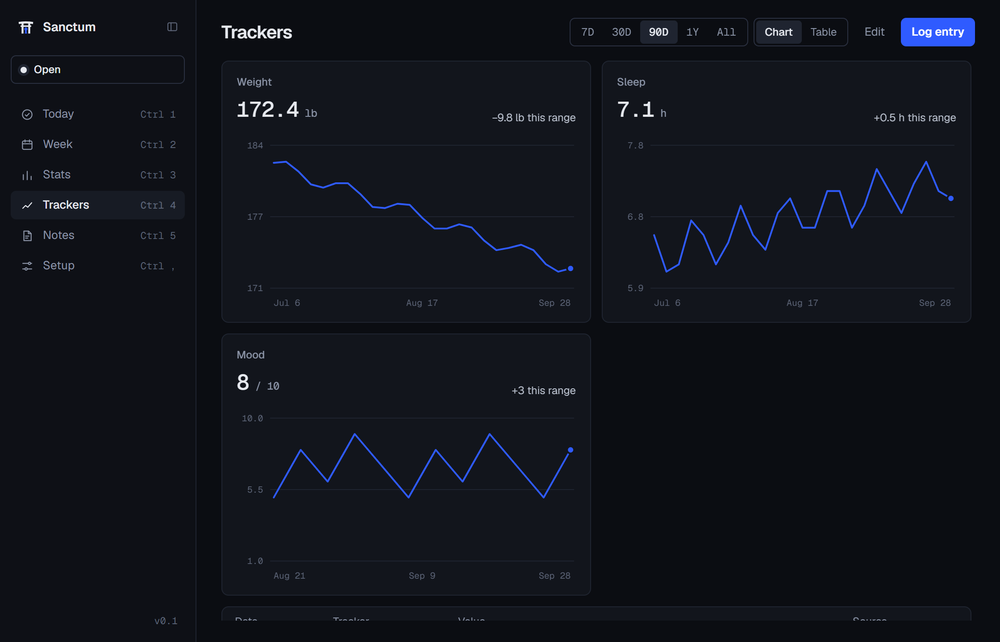 | 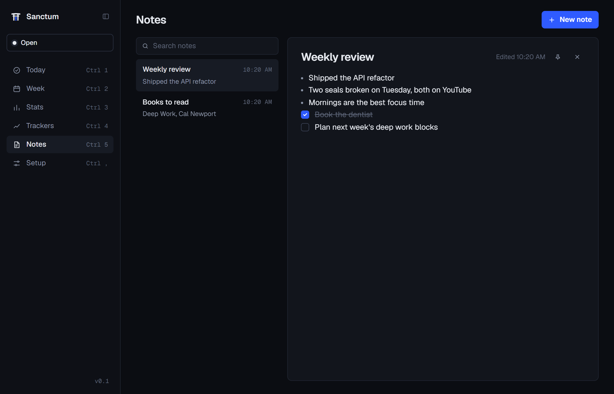 |

### An accountability partner, on their phone

Invite a friend. When you ask to leave early, they get an email and answer from a phone-first page with their PIN. They also hear when a seal breaks. The partner is optional, and everything else works without an account.

<p align="center">
  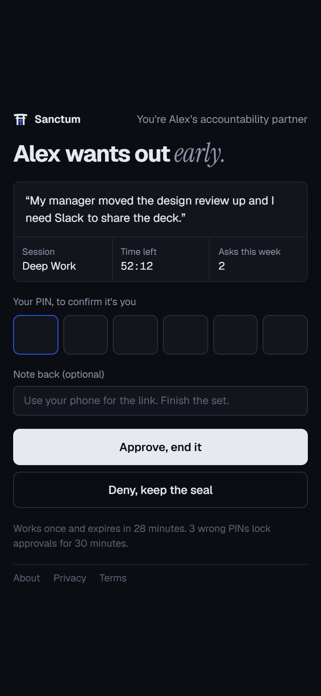
</p>

### Set it up once

One Distractions list for apps, sites, links, and keywords; **quiet hours** that block it on a schedule; **Protection**, a Windows service that blocks sites in every browser and reopens Sanctum if it's closed; and the details: Do Not Disturb while sealed, sounds, export, and backups.

| Distractions and quiet hours | Protection |
|---|---|
| 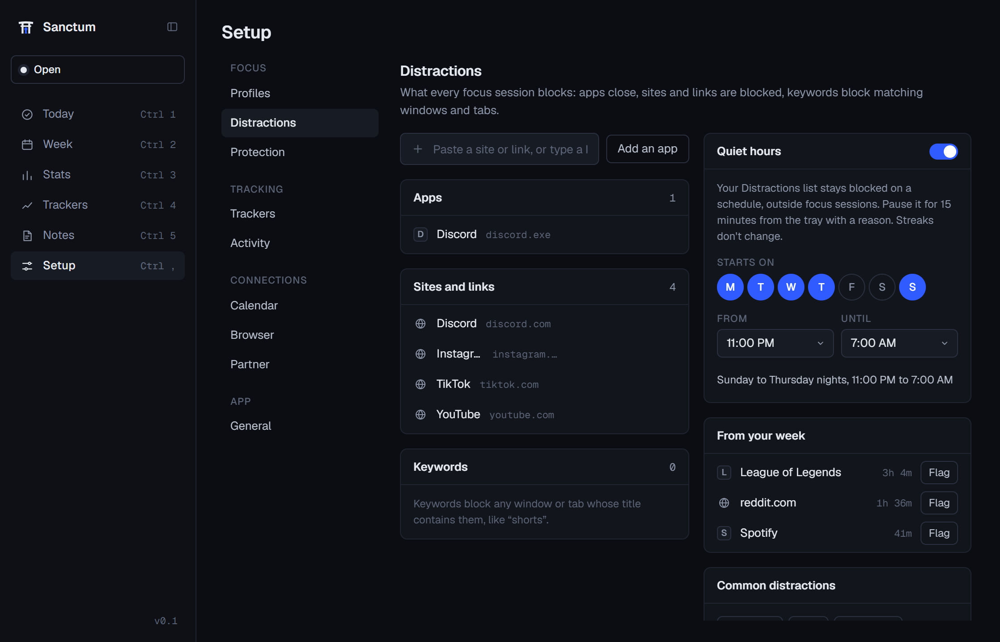 | 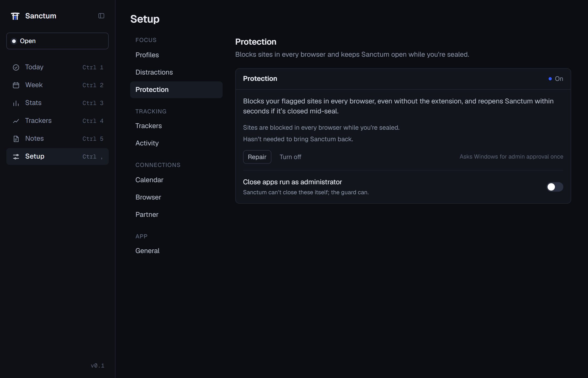 |

---

## Everything it does

**Focus**
- Profiles for each kind of work: the apps and links it opens, and a default length (30 to 120 minutes).
- One Distractions list of apps (including Microsoft Store apps), sites, links with allowed pages, and title keywords. Every seal blocks them.
- Flagged apps close within a fraction of a second of starting. Keyword windows are minimized.
- Idle pauses the countdown and pushes the end back, so the time you get is the time you focused.
- Link a session to a task, and check it off when the seal holds.
- Windows Do Not Disturb while sealed; your setting comes back after.

**Holding the seal**
- Leaving early: a reason and a wait, retyping a paragraph, then a 30-minute cooldown, or your partner's approval. One emergency unlock a week.
- Protection (optional, one admin prompt): blocks flagged sites in the hosts file for every browser, reopens Sanctum within seconds if it's closed, and can close flagged apps run as administrator.
- Tamper detection: changing the clock, stopping the guard, or turning off the extension mid-seal breaks the seal, and your partner hears about it.
- Quiet hours: your Distractions list blocked on a schedule outside sessions, with a 15-minute pause that asks why.

**Your day**
- Today and Week: routines, one-time tasks, and Google Calendar events, synced two ways.
- Focus blocks on your calendar suggest the right profile when they start.
- In event: a meeting holds focus, and you can queue a session for when it ends.
- Ctrl K to jump anywhere, add a task, flag a distraction, or start focus with any profile.

**Review**
- Stats: streaks, rest days, kept and broken days, what tempted you, and where the time went.
- Trackers with charts and check-ins, and notes.
- Export everything as JSON or CSV, back up, and restore.

---

## How it compares

| | Sanctum | Cold Turkey | Freedom | Windows Focus |
|---|:-:|:-:|:-:|:-:|
| Price | Free | Free, paid Pro | Subscription | Built in |
| Open source | ✓ | | | |
| Blocks apps and sites | ✓ | ✓ | ✓ | |
| A friend approves early exits | ✓ | | | |
| Planner with two-way Google Calendar | ✓ | | | |
| Your activity stays on your PC | ✓ | ✓ | | ✓ |

<sub>From each product's public feature descriptions as of October 2026. Something out of date? Open an issue.</sub>

---

## Install

1. Download `Sanctum_x.y.z_x64-setup.exe` from the [latest release](https://github.com/ryanhang07/sanctum/releases/latest) and run it. It installs for your user, with no admin prompt.
2. Sanctum isn't code-signed yet, so Windows SmartScreen may show "Windows protected your PC". Click **More info**, then **Run anyway**.
3. First-run setup walks you through profiles and your Distractions list. Sanctum updates itself from Releases (Setup › General › About).

Then, in the app:

- **Browser extension** (Setup › Browser). Open `chrome://extensions` (or `edge://extensions`, `brave://extensions`), turn on **Developer mode**, click **Load unpacked**, and pick the folder Setup shows. Then open **Details** and turn on **Allow in Incognito**.
- **Protection** (Setup › Protection). Turn it on with one admin approval. It installs the Sanctum Guard service.
- **Google Calendar and a partner** (Setup › Calendar, Setup › Partner) are optional.

## Keyboard

| Keys | Does |
|---|---|
| Ctrl Enter | Enter focus |
| Ctrl K | Search or command |
| Ctrl 1 to 5 | Today, Week, Stats, Trackers, Notes |
| Ctrl , | Setup |
| Ctrl M | Compact timer (while sealed) |
| Ctrl B | Collapse the sidebar |

## Privacy

Sanctum is local first. Sessions, activity (which app and window is in front), tasks, trackers, notes, and stats are stored in a database on your PC and never uploaded. Google Calendar data travels only between your PC and Google. The optional account stores just what the partner feature needs: your email, partner links, a hashed PIN, and unlock requests. Read the full [privacy policy](https://sanctum-partner.vercel.app/privacy) and [terms](https://sanctum-partner.vercel.app/terms).

## FAQ

**Can't I just close it?**
While you're sealed, closing the window sends Sanctum to the tray, and Quit is disabled. With Protection on, a Windows service reopens it within seconds if it's killed, and the restart is logged.

**What if my PC restarts mid-session?**
The seal resumes where it left off. Downtime longer than a minute counts against the session, so it can't finish as kept.

**Does it work offline?**
Yes. Everything but Calendar sync and the partner works without a connection.

**Mac or Linux?**
Windows only for now. The code is designed for macOS later.

**Is it really free?**
Yes, MIT licensed, no account required, no ads, no tracking.

---

## Build from source

Requirements: Windows 10 or 11, [Node.js 22](https://nodejs.org), [Rust](https://rustup.rs) (stable, MSVC), and the [WebView2 runtime](https://developer.microsoft.com/microsoft-edge/webview2/) (preinstalled on Windows 11).

```powershell
git clone https://github.com/ryanhang07/sanctum.git
cd sanctum
npm install
npm run tauri dev
```

Dev builds keep their own database (`sanctum-dev.db`) and seed sample profiles. `npm run dev` runs the UI alone in a browser against an in-memory mock of the Rust side.

```powershell
npm test               # frontend tests (Vitest)
npm run test:rust      # Rust tests
npm run typecheck
npm run tauri build    # the NSIS installer, in src-tauri/target/release/bundle/nsis
npm run screenshots    # this README's screenshots and GIF (needs Edge and Python with Pillow)
```

### Optional services

Google Calendar sync and the account and partner features need your own keys. Without them those features say they aren't set up, and everything else works. Copy `src-tauri/.env.example` to `src-tauri/.env` and follow [docs/self-hosting.md](docs/self-hosting.md).

### Built with

[Tauri 2](https://tauri.app) and Rust for the app, the blocker, and the guard service; React 19, TypeScript, Tailwind, and Zustand for the UI; SQLite on your PC; a Chromium MV3 extension with native messaging; and Supabase and Vercel for the optional partner features.

| Path | What |
|---|---|
| `src/` | The React UI: pages, components, state (Zustand), and a mock backend for browser dev and tests |
| `src-tauri/` | The Rust app: session engine, blocker, activity tracking, calendar sync, guard service, SQLite |
| `extension/` | The Chromium MV3 extension, talking to the app through native messaging |
| `partner/` | The partner's web page (Vite), deployed separately |
| `supabase/` | Database migrations and Edge Functions for the account and partner |
| `design/` | The design reference: screens, tokens, and the logo |
| `SPEC.md` | What Sanctum does and why, milestone by milestone |

## Roadmap

- The extension in the Chrome Web Store and Edge Add-ons, and Firefox, Opera, Vivaldi, and Arc support
- A code-signed installer
- Closing private windows while sealed until the extension is allowed there
- A light theme
- macOS

Ideas and votes welcome in [Issues](https://github.com/ryanhang07/sanctum/issues).

## Contributing

Issues and pull requests are welcome. For a bug, include what Setup › General › About › **Copy diagnostics** gives you. Keep changes in the voice and design of the app (see `design/README.md`), with tests. See the [CHANGELOG](CHANGELOG.md) for what's shipped.

## License

[MIT](LICENSE) © Ryan Hang
